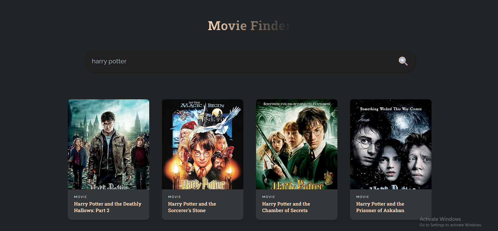
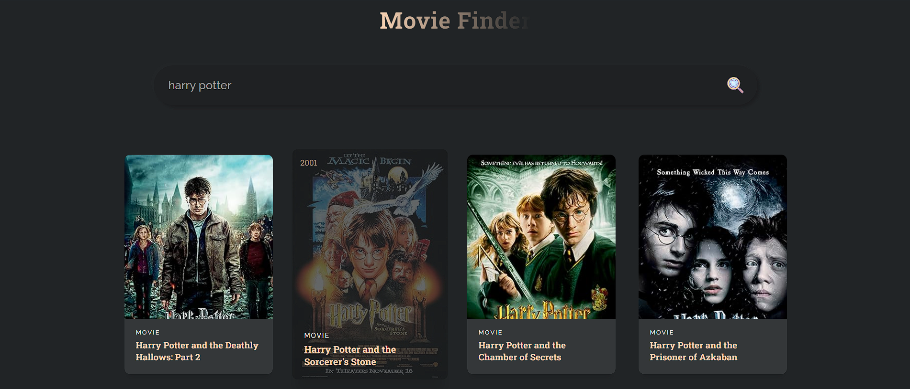

# Movie Finder
A ReactJS-based movie search application that uses the [OMDb API](https://www.omdbapi.com/) to fetch and display information about movies. The app allows users to search for movies by title and displays the results, including movie posters, titles, release years, and types (e.g., movie, series).

## Features
* **Search Movies:** Allows users to search for movies by entering a title.
* **Display Results:** Shows a list of movies matching the search criteria, including their posters, titles, years, and types.
* **Responsive Design** Optimized for various screen sizes.

## Getting Started

#### Prerequisites

* Node.js and npm installed on your machine.

#### Installation
1. **Clone the repository:**
    ```bash
    git clone https://github.com/Adlichalbi/React-MovieFinder-App.git
    cd React-MovieFinder-App
    ```
2. **Install dependencies:**
    ```bash
    npm install
    ```
3. **Set up environment variables:**
* Create a `.env` file in the root of the project
* Add your OMDb API Key:
    ```env
    VITE_KEY_Movie=http://www.omdbapi.com/?apikey=your_omdb_api_key

    ```
4. **Start the development server:**
    ```bash
    npm run dev
    ```
5. **Access the app:**
* Open your browser and go to `http://localhost:3000`

## Usage
1. **Search for a movie:** Enter the movie title in the search bar and press Enter or click the search icon.
2. **View movie details:** The app will display the poster, title, year, and type of each movie that matches the search.

## Screenshots


## Technologies Used
* **ReactJS:** Frontend framework
* **CSS:** Styling the application
* **OMDb API:** Fetching movie data

## License
This project is licensed under the MIT License.
## Contributing
Contributions are welcome! Please fork this repository and submit a pull request if you'd like to make improvements or add features.

## Contact
For any questions or feedback, please contact [Adli Chalbi](https://github.com/Adlichalbi).